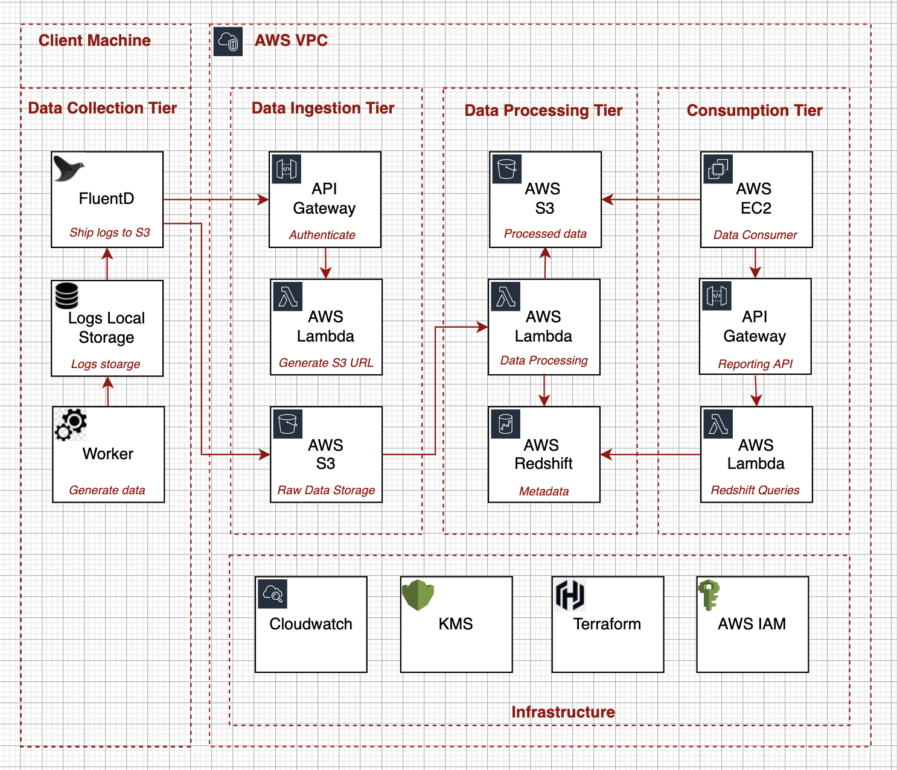

# Part 2: Data pipeline System Design Document

## Background
Design the architecture (components and flows) for a data pipeline for machine learning research in the cloud. No need to implement anything, only design it. Assume this data pipeline serves only research (and not production) purposes, i.e. it has low scale, few users, no significant load or latency requirements.

## Requirements

### Functional Requirements
- Each day 10 recording sessions occur. Each recording session results in one folder which includes binary data files and a text file that houses its meta-data. With total size of 600 MB per session.
- The data needs to be uploaded to the cloud (AWS S3), once there, the meta-data for each recording session should
be added to a database. The raw data is the most valuable, so should be stored in such a way as could be easily
accessed, but not erased mistakenly.
- Once uploaded, a data preprocessing flow should be triggered only on the new data resulting in preprocessed data.
- Clients should then be able to query the database, and should receive a list of preprocessed data files matching the query criteria. Finally, these preprocessed data files must be accessible on an AWS EC2 node for use.
- Assume each recording session is stored in a local directory with a date-string of the time it was recorded (e.g.
20210229_161221)
- Assume meta-data has both numerical variables (e.g. level of subject fatigue), and text variables (e.g. hardware
model)
- Data flow
    - Define the mechanism of how data will be uploaded to S3
    - Define how metadata vs. binary data will be stored

### Non-Functional Requirements
- Database(s)
    - Select a database solution
    - Motivate your choice
    - Describe in detail how data will be stored
    - Define how and who will query the database, and how
- Error handling
    - Describe automation of all of the data pipeline steps
    - Define which steps will have “sanity checks”, and define what they will be
    - Define a system for handling errors and logging information/errors, both in the cloud and to a local client
- Deliverables
    - Diagram of your architecture.
    - Definition of each processing step along the way.
    - Short written descriptions of each choice of technology (e.g. database).

## System APIs
- Data Ingestion
  - authenticate(apiKey): returns [token](https://docs.aws.amazon.com/apigateway/latest/developerguide/http-api-jwt-authorizer.html) for upcoming operations  
  - getPresignedS3Url(token, fileName): return [presigned](https://docs.aws.amazon.com/AmazonS3/latest/userguide/using-presigned-url.html) s3 url 
  - uploadData(presignedS3Url): uploads file to S3 using [presigned](https://docs.aws.amazon.com/AmazonS3/latest/userguide/PresignedUrlUploadObject.html) URL
- Data Consumption
  - getObjectLists(query): returns the list of s3 object urls by the query criteria
  - getListOfrecordingSessions(): returns the list of all preprocessed recorded session

## High-Level Design
The proposed architecture is a stack of five logical tiers (layers): data collection, data ingestion, data processing, and data consumption. Each layer consists of multiple components.   

<table width="256px">
  <tr>
    <td></td>
  </tr>
</table>

The Layered Architecture approach promotes separation of concerns and flexibility to add or remove data sources, add new data consumers, change processing methods.

## Detailed Design 

### Data Collection Tier
Data Collection Tier is all about collecting log files from the client machines. The flow is simple - each client machine will be preinstalled with the log shipping software like [fluentd](https://www.fluentd.org/), [logstash](https://www.elastic.co/logstash/) or custom made log shipper that is activated by a [chron job](https://en.wikipedia.org/wiki/Cron). It is better to rely on open-source software since most log shipping problems are solved there (reliability, performance, extensibility, etc). So, the log shipper will watch a certain directory for new logs, and once log files are ready, it will request the Data Ingestion API to provide the pre-signed S3 Url and will upload files to the S3 bucket.

### Data Ingestion Tier
The Data Ingestion Tier consists of three components - [API Gateway](https://docs.aws.amazon.com/apigateway/latest/developerguide/welcome.html), [AWS Lambda](https://aws.amazon.com/lambda/) and [AWS S3](https://aws.amazon.com/s3/). This tier is responsible for the data delivery to the S3 bucket. The main concern when delivering the data to the private S3 bucket in the [AWS VPC](https://aws.amazon.com/vpc/) is security and reliability
- Only authenticated clients can upload files to the S3 bucket
- S3 objects are immutable (read-only), cannot be overwritten
- The S3 upload is reliable. The failed upload session will be tracked and retried. All fatal failures will be tracked in [AWS CloudWatch](https://aws.amazon.com/cloudwatch/)

<table width="256px">
  <tr>
    <td></td>
  </tr>
</table>

The only implementation that is needed in this tier is in AWS Lambda. AWS Lambda is responsible for validating api keys and generating pre-signed S3 urls by using [boto3](https://boto3.amazonaws.com/v1/documentation/api/latest/guide/s3-presigned-urls.html). AWS API Gateway will take care of providing public REST API, performing the IP whitelisting, IP rate limits and handling HTTPs [certificates](https://docs.aws.amazon.com/apigateway/latest/developerguide/getting-started-client-side-ssl-authentication.html). And finally, when the authenticated flow is done and pre-signed s3 url is ready, the log shipper will be able to upload the files to the private S3 bucket for 'raw data'. The data in the bucket will be partitioned by recording session id. For eample it can be stored in s3://cogntiv_raw_data/20210229_161221/. [New_Object_Created](https://docs.aws.amazon.com/AmazonS3/latest/userguide/NotificationHowTo.html) notification is enabled on the raw_data bucket and it is used in the Data Processing Tier.

### Data Processing Tier
Data Processing Tier contains all the logic that performs cleaning, pre-processing, and aggregation of the input data. When the new metadata file lands in the raw_data S3 bucket the [New_Object_Created](https://docs.aws.amazon.com/AmazonS3/latest/userguide/NotificationHowTo.html) notification [invokes](https://docs.aws.amazon.com/AmazonS3/latest/userguide/how-to-enable-disable-notification-intro.html) AWS Lambda function. As in Data Ingestion Tier, all the needed logic resided in the AWS Lambda function. The choice between the AWS Lambda, provisioned EC2, and the Fargate, is explained in the Cost Analysis section. So once the metadata file lands in the raw_data bucket, the AWS Lambda is launched. AWS Lambda validates the content of metadata. If the content is broken or illegal, the error notification goes to the AWS Cloudwatch. If the data is legal, the AWS Lambda function parses it and inserts it to the [AWS Redshift](https://aws.amazon.com/redshift/). In case of the binary data, it is just copied to the processed_data S3 bucket.
<table width="256px">
  <tr>
    <td></td>
  </tr>
</table>

The core component of the data processing tier is the database that stores the metadata. Our choice is the AWS Redshift. AWS Redshift has the following pros:
- Capacity: AWS Redshift is the columnar storage and can be easily scaled to handle big volumes (Petabytes) of data
- Efficiency: AWS Redshift separates compute and storage, and thus is flexible and can be optimized for any data flow requirements.   
- Cost: when dealing with the low volumes of data and low numbers of requests, we can use the [serverless](https://aws.amazon.com/blogs/aws/introducing-amazon-redshift-serverless-run-analytics-at-any-scale-without-having-to-manage-infrastructure/) version of the Redshift. By doing so, we can keep the overall cost of the database low
- Test: AWS Redshift is based on PostgreSQL and thus is replaceable by PostgreSQL DB for test purposes. For example, when running the e2e in the SandBox.  
The last component of the Data Processing Tier is the Reporting API that is implmented by the API Gateway and AWS Lambda. For separation of concerns, we do not expose the database to data consumers. The data schema is the matter of change. It can be changed as a result of adding new datasource or as a result of db optimization activities. And thus, the only component that actually access the reporting code that runs in AWS Lambda that is invked by the API .  

### Data Consumption Tier
Data Consumption Tier consist of provisioned EC2 machines. Data researches are using these machines to run ML pipelines and data analysis code. They can access the metadata in redshift by using the Reporting API. The data in S3 can be accessed directly once the S3 url is obtained for the 

## CI/CD and Testing - TBD
- [Github](https://github.com)
- [CircleCI](https://github.com/marketplace/circleci)
- Untitesting - min of 90% coverage [TBD]
- Code Style Checking [TBD]
- SandBox for E2E [TBD]
- Staging Environment [TBD]
- Production Environment [TBD]
- Infra as Code - Terraform [TBD]
[TBD]

## Monitoring and Alerting - TBD
- [AWS Cloudwatch](https://aws.amazon.com/cloudwatch/)
- Flow Error Handling: all steps in the data flow 
- Metrics Dashboards - TBD
- Alerting [TBD]  
[TBD]

## Cost

## Analysis
- Cost
- Security
- Reliability
- Performance Efficiency
- Operation Excellence